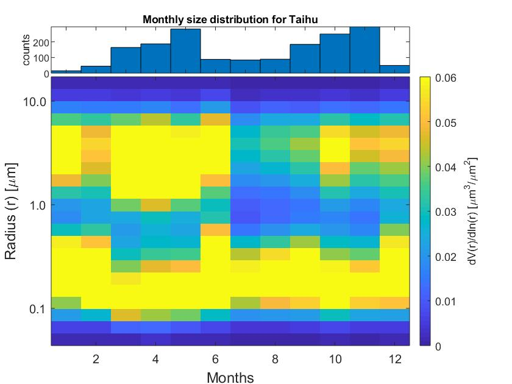

## AERONET-Data-Analysis
[](https://lbesson.mit-license.org/)

These are some upgrated MATLAB code based on [hmjbarbosa/aeronet](https://github.com/hmjbarbosa/aeronet) repository. Version 3.0 products is supported and basic functions, like reading data and data visualization, are added.

### Data Download

Request data from web service can be done through [AERONET Web Service](/doc/data_download.md). For individual site, you can follow the method described in [hmjbarbosa/aeronet](https://github.com/hmjbarbosa/aeronet).

### Usage

Download the data manually with the method described in [Data Download](#DataDownload).

Read data

``` matlab
AOD = read_aeronet_AOD_v3_lev2(file);
```

Visualize the data

```
mask = (AOD_Res.PWV < 6) & (AOD_Res.AOD_500 ~= -999) & (AOD_Res.AE_440_870 ~= -999);
display_time_series(AOD_Res.date_time(mask), AOD_Res.AOD_500(mask), 'AOD @ 500 nm', 'Sunphotometer analysis for Taihu');
```

You can follow the [example](example_analysis_taihu.m) in this repository to start some basic analysis.


### Figures

There are some basic visualization functions inside the `lib` folder. Below are some figures that can be produced by the function:




